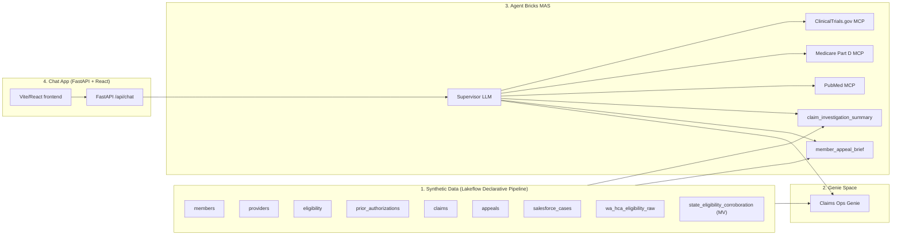

# Medicare Appeals Triage Demo

End-to-end Databricks demo showing how to build a Medicare appeals triage assistant on top of Unity Catalog data, an Agent Bricks Multi-Agent Supervisor, Genie, UC functions, and external MCP servers — wrapped in a chat app you can ship to claims operations teams.

The repo is a Databricks Asset Bundle (DAB). Set 4 variables in `databricks.yml`, then `databricks bundle deploy` provisions everything.

## Architecture



## Quickstart

```bash
# 0. Prereqs: Databricks CLI v0.260+ authenticated against your workspace, a SQL warehouse, and a UC catalog you can create.

# 1. Configure
cp databricks.yml databricks.local.yml   # optional override file
# Edit databricks.yml — set workspace.host, catalog, schema, warehouse_id, MCP bearer tokens.

# 2. Deploy the bundle
databricks bundle validate
databricks bundle deploy --target dev

# 3. Run the bootstrap job (generates data, registers UC fns, creates MCP connections, creates Genie space, creates MAS)
databricks bundle run bootstrap_job --target dev

# 4. Open the deployed app
databricks bundle run medicare_appeals_chat --target dev
```

## What gets provisioned

| Stage | Asset | Defined in |
|---|---|---|
| 1 | Catalog + schema + 8 tables + 1 MV + 1 streaming table + 6 metric views | `data/pipeline.py` + `resources/data_pipeline.yml` |
| 2 | Genie space "Claims Ops" with attached tables + sample questions | `genie/create_genie_space.py` |
| 3 | 2 UC functions + 3 external MCP connections + AB MAS endpoint | `uc_functions/*.sql`, `mas/create_mcp_connections.sql`, `mas/create_mas.py` |
| 4 | Databricks App (FastAPI + React) wired to the MAS endpoint | `app/` + `resources/app.yml` |

## Repo layout

```
medicare-appeals-chat/
├── databricks.yml              DAB top-level + variables
├── resources/                  DAB resource specs (pipeline, jobs, app)
├── data/                       Synthetic data generator + LDP definitions
├── genie/                      Genie space create + sample questions
├── uc_functions/               SQL DDL for the two UC functions
├── mas/                        MCP connection DDL + MAS create script
├── app/                        Chat app (frontend + FastAPI backend)
├── scripts/                    bootstrap.sh + tear_down.sh helpers
└── docs/                       architecture.md + reproduce.md
```

## Known issues

- **UC functions can be slow.** `member_appeal_brief` and `claim_investigation_summary` issue multi-table aggregations. On a small (2X-Small) warehouse against a fresh synthetic dataset they typically return in <10s, but on cold warehouses they can take 60s+ to start. Set `WAREHOUSE_AUTO_STOP_MINS=60` in `databricks.yml` if you hit timeouts.
- **MCP servers need bearer tokens.** The 3 MCP connections (`conn_aichemy_pubmed`, `raven_medicare_mcp`, `conn_clinicaltrials`) expect HTTP+BEARER auth. ClinicalTrials.gov works with `auth.mode=none` if the upstream server allows it; the other two require real tokens. See `mas/create_mcp_connections.sql`.
- **Genie space curation isn't fully API-driven.** The REST endpoints for `/instructions` and `/curated-questions` aren't public. `genie/create_genie_space.py` creates the space and attaches tables programmatically, then prints the URL for you to add curation in the UI.

## License

Databricks license (see [`LICENSE`](LICENSE)) — same as the [Databricks Industry Solutions](https://github.com/databricks-industry-solutions) accelerators (e.g. [x12-edi-parser / Ember](https://github.com/databricks-industry-solutions/x12-edi-parser)). Use of these materials is permitted in connection with your use of the Databricks Services.
