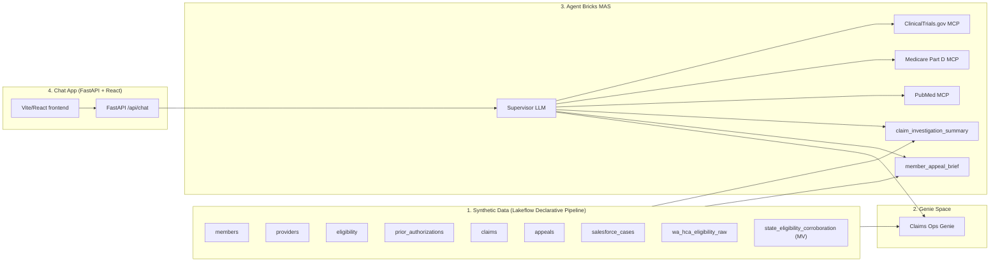

# Medicare Appeals Triage Demo

End-to-end Databricks demo showing how to build a Medicare appeals triage assistant on top of Unity Catalog data, an Agent Bricks Multi-Agent Supervisor, Genie, UC functions, and external MCP servers — wrapped in a chat app you can ship to claims operations teams.

The repo is a Databricks Asset Bundle (DAB). Set 4 variables in `databricks.yml`, then `databricks bundle deploy` provisions everything.

## Architecture



## Quickstart

```bash
# 0. Prereqs: Databricks CLI v0.260+ authenticated against your workspace, a SQL warehouse, and a UC catalog you can create.

# 1. Configure (see "Required configuration" below)
cp databricks.yml databricks.local.yml   # optional override file
# Edit databricks.yml — set workspace.host, catalog, schema, warehouse_id, MCP bearer tokens.

# 2. Deploy the bundle
databricks bundle validate
databricks bundle deploy --target dev

# 3. Run the bootstrap job (generates data, registers UC fns, creates MCP connections, creates Genie space, creates MAS)
databricks bundle run bootstrap_job --target dev

# 4. Open the deployed app
databricks bundle run medicare_appeals_chat --target dev
```

## Required configuration

Before `databricks bundle deploy`, set these variables in `databricks.yml` (or in a `databricks.local.yml` override). The app reads `catalog` and `schema` at runtime through the env vars `CATALOG` and `SCHEMA` that the bundle templates into `app/app.yaml`.

| Variable | Required | Notes |
|---|---|---|
| `catalog` | Yes | Unity Catalog name where the demo's tables, MV, UC functions, and Genie space will live. Must be a valid UC identifier. Default: `medicare_appeals_demo`. |
| `schema` | Yes | Schema name under the catalog. **Use underscores, not dashes** — UC functions and some downstream tooling don't tolerate dashed schema names the same way managed tables do. Default: `appeals_review`. |
| `warehouse_id` | Yes | SQL warehouse used by the data pipeline, UC functions, the app's `/api/summary` endpoint, and Genie. The SP that runs the deployed app must have `CAN_USE` on this warehouse. |
| `genie_space_id` | After stage 2 | Output of `genie/create_genie_space.py`. Paste it back into `databricks.yml` before re-deploying the MAS and app. |
| `mas_endpoint_name` | After stage 3 | Output of `mas/create_mas.py` (or the AB MAS UI). Paste it back into `databricks.yml` before re-deploying the app. |
| `pubmed_mcp_token`, `partd_mcp_token`, `clinicaltrials_mcp_token` | Yes for MCP routing | Bearer tokens stored in the UC connections. Leave `clinicaltrials_mcp_token` as a placeholder if the upstream server allows `auth.mode=none`. |

The service principal that runs the deployed app needs at minimum:

- `USE_CATALOG` on `<catalog>`
- `USE_SCHEMA` on `<catalog>.<schema>`
- `SELECT` on all tables under `<catalog>.<schema>`
- `EXECUTE` on the two UC functions (`member_appeal_brief`, `claim_investigation_summary`)
- `CAN_USE` on the warehouse named by `warehouse_id`
- `CAN_RUN` on the Genie space named by `genie_space_id`
- `CAN_QUERY` on the MAS serving endpoint

`databricks bundle deploy` grants the app-resource permissions automatically; the catalog, schema, and warehouse grants need to exist beforehand or be granted manually after bootstrap.

## What gets provisioned

| Stage | Asset | Defined in |
|---|---|---|
| 1 | Catalog + schema + 8 tables + 1 MV + 1 streaming table + 6 metric views | `data/pipeline.py` + `resources/data_pipeline.yml` |
| 2 | Genie space "Claims Ops" with attached tables + sample questions | `genie/create_genie_space.py` |
| 3 | 2 UC functions + 3 external MCP connections + AB MAS endpoint | `uc_functions/*.sql`, `mas/create_mcp_connections.sql`, `mas/create_mas.py` |
| 4 | Databricks App (FastAPI + React) wired to the MAS endpoint | `app/` + `resources/app.yml` |

## Repo layout

```
medicare-appeals-chat/
├── databricks.yml              DAB top-level + variables
├── resources/                  DAB resource specs (pipeline, jobs, app)
├── data/                       Synthetic data generator + LDP definitions
├── genie/                      Genie space create + sample questions
├── uc_functions/               SQL DDL for the two UC functions
├── mas/                        MCP connection DDL + MAS create script
├── app/                        Chat app (frontend + FastAPI backend)
├── scripts/                    bootstrap.sh + tear_down.sh helpers
└── docs/                       architecture.md + reproduce.md
```

## Known issues

- **UC functions can be slow.** `member_appeal_brief` and `claim_investigation_summary` issue multi-table aggregations. On a small (2X-Small) warehouse against a fresh synthetic dataset they typically return in <10s, but on cold warehouses they can take 60s+ to start. Set `WAREHOUSE_AUTO_STOP_MINS=60` in `databricks.yml` if you hit timeouts.
- **MCP servers need bearer tokens.** The 3 MCP connections (`conn_aichemy_pubmed`, `raven_medicare_mcp`, `conn_clinicaltrials`) expect HTTP+BEARER auth. ClinicalTrials.gov works with `auth.mode=none` if the upstream server allows it; the other two require real tokens. See `mas/create_mcp_connections.sql`.
- **Genie space curation isn't fully API-driven.** The REST endpoints for `/instructions` and `/curated-questions` aren't public. `genie/create_genie_space.py` creates the space and attaches tables programmatically, then prints the URL for you to add curation in the UI.

## License

Databricks license — see [`LICENSE`](LICENSE).

This repo is a **solution accelerator**.

> **DISCLAIMER:** This is for reference and not meant to be for production environments. There is no SLA nor continued support as this is not an official Databricks asset. For more information, please contact your representative.

> **NOTE:** This repo works on **AWS Databricks** currently and would need slight configuration changes for Azure and GCP.
